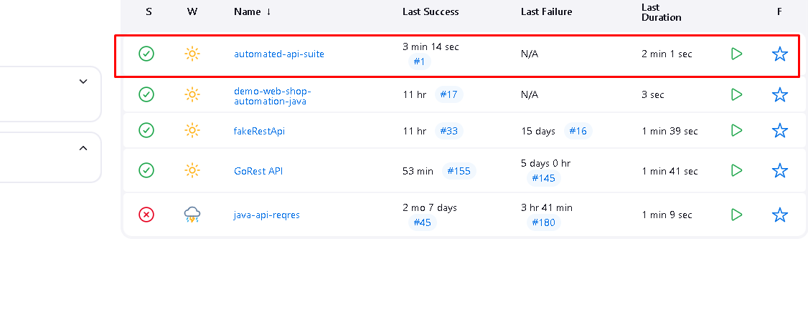

# 🧪 Automação de Testes de API - automated-api-suite

Automação de testes da API **[inserir nome da API real, se desejar]**, desenvolvida em **Java 17**, utilizando **RestAssured**, **Cucumber (BDD)**, **JUnit** e **Hamcrest**.  
O projeto inclui **relatórios detalhados com Extent Reports**, **geração de evidências em PDF** e integração contínua com **GitHub Actions**, **GitLab CI/CD** e **Jenkins**.

---

## 🚀 Objetivo

Automatizar testes de API com foco em:

- ✅ Testes automatizados para métodos HTTP (GET, POST, PUT, DELETE)
- ✅ Escrita de cenários com Cucumber (BDD)
- ✅ Validações com Hamcrest
- ✅ Geração de evidências em PDF
- ✅ Integração contínua com GitHub Actions, GitLab CI/CD e Jenkins
- ✅ Relatórios completos com **Extent Reports**

---

## 📊 Relatórios com Extent Reports

O projeto utiliza a biblioteca **Extent Reports** para gerar relatórios visuais e interativos ao final da execução dos testes. Esses relatórios fornecem uma visão clara do status dos testes, incluindo:

- ✔️ Cenários executados
- ✔️ Resultados (pass/fail)
- ✔️ Logs detalhados
- ✔️ Capturas de evidências (quando aplicável)

---

## 🛠️ Tecnologias Utilizadas

| Tecnologia           | Finalidade                                        |
|----------------------|--------------------------------------------------|
| Java 17              | Linguagem base                                   |
| Maven                | Gerenciador de dependências                      |
| Cucumber 6           | Testes BDD com escrita de cenários em Gherkin    |
| JUnit 4              | Framework de execução dos testes                 |
| REST-assured 5.2.0   | Testes de APIs REST                              |
| Hamcrest 2.2         | Validações mais expressivas                      |
| Extent Reports 5     | Geração de relatórios interativos de testes     |
| iText 9              | Geração de evidências em PDF                     |
| Java Faker 1.0.2     | Geração de dados dinâmicos para testes           |
| org.json             | Manipulação de objetos JSON                      |

---

## ▶️ Como Executar Localmente

### ✅ Pré-requisitos

- Java 17 instalado  
- Maven 3.8+ instalado  

### ▶️ Comando de execução

```bash
mvn clean test

```

## ⚙️ Integração Contínua

- **GitHub Actions**: Automatização via workflows YAML  
- **Jenkins**: Pipeline definido no Jenkinsfile para execução contínua e agendada

### 📸 Exemplo de Job Agendado no Jenkins



---

## 📌 Status do Projeto

✅ **CONCLUÍDO**
